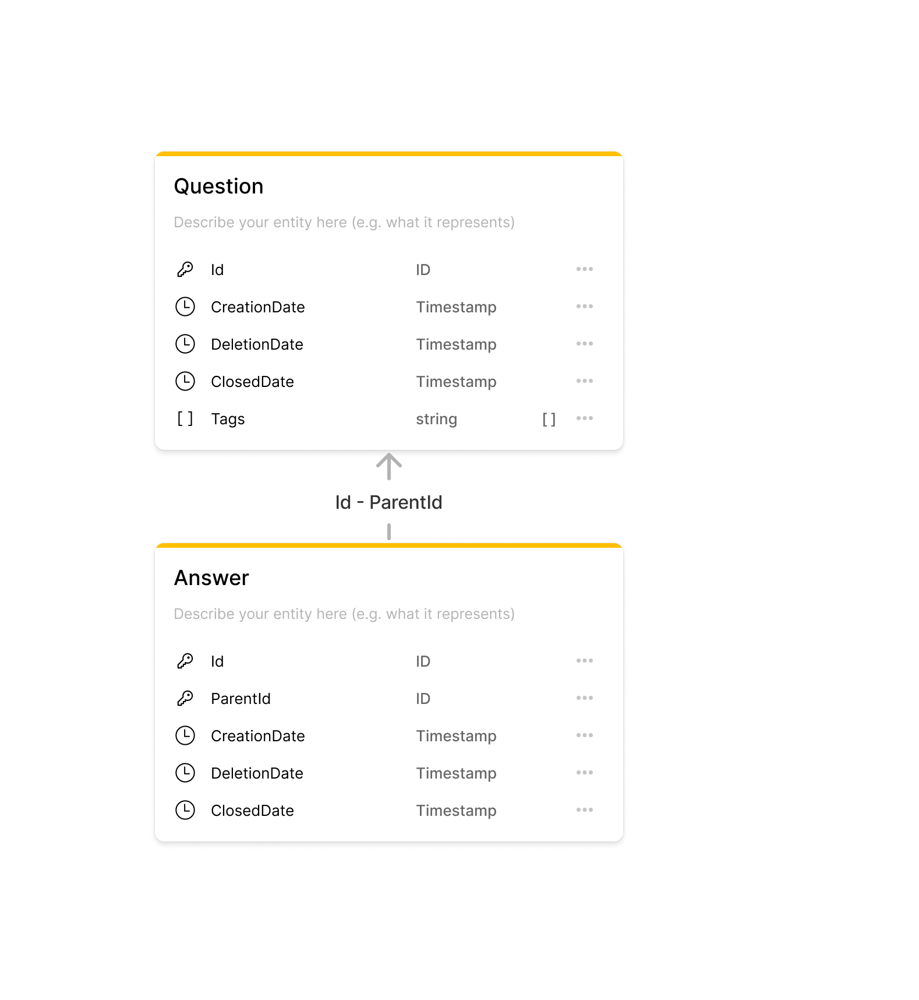
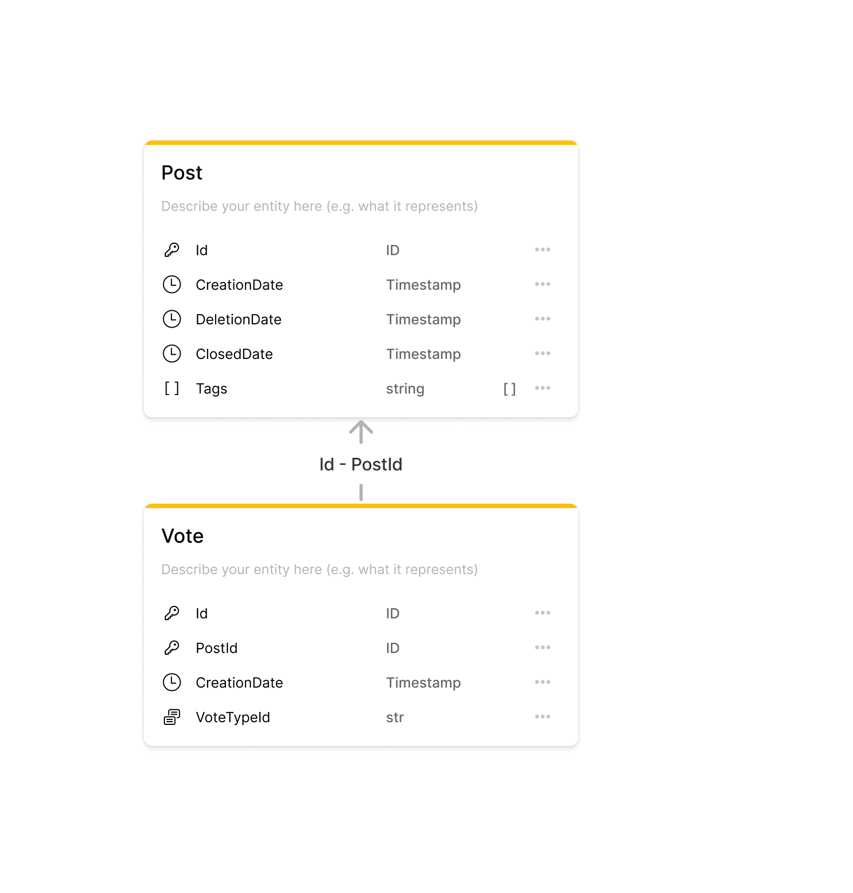

## Exploring StackOverflow tags trends

### Short description
Exploring top trending tags on StackOverflow by number of submitted questions, answers and votes.

### Introduction
[Stackoverflow Trends](https://insights.stackoverflow.com/trends) is a great place to see how progress of certain tag
over time. However, it provides possibility to show trends for requested tags. Primary motivation of this post is to
explore and compare all tags trends between each other for past several years, to find the most rapidly growing.

For this we are going to use ["Stack Exchange Data Dump" published to Internet Archive](https://archive.org/details/stackexchange)
that contains various data dumps for whole "Stack Exchange" websites family. In particular, we are going to use posts and votes data.
First we will start with some high level ideas, then proceed found results and cover some implementation details at the end.   

### Data model
Stack Exchange data dump is a pretty broad one and covers all sorts of data related to users, activity etc. 
For more details, you can see data set description at [readme.txt](https://ia904700.us.archive.org/6/items/stackexchange/readme.txt) file.
In scope of this exploration, we are interested in just a subset of following files:
- `Posts.xml` - all posts data;
- `Votes.xml` - all votes data;

`Posts.xml` contains both questions and answers. Fields that are used for analysis are the following:   
```
- Id 
- PostTypeId
  - 1: Question
  - 2: Answer
- ParentId (only present if PostTypeId is 2)
- CreationDate 
- DeletionDate
- ClosedDate, e.g.:"2009-03-11T12:51:01.480" 
- Tags
```
Despite its flat structure, data model it represents can be shown with the following diagram:


So, questions have one-to-many relations with answers and it might be fair to say that answers implicitly inherits 
its parent question `Tags`. 

Similarly, for `Votes.xml` file the fields that will be used are:
``` 
- Id 
- PostId 
- VoteTypeId
  - 1: AcceptedByOriginator
  - 2: UpMod (upvote)
  - 3: DownMod (downvote)
  - 4: Offensive
  - 5: Favorite - if VoteTypeId = 5 UserId will be populated
  - 6: Close
  - 7: Reopen
  - 8: BountyStart
  - 9: BountyClose
  - 10: Deletion
  - 11: Undeletion
  - 12: Spam
  - 13: InformModerator
  - 15: ModeratorReview
  - 16: ApproveEditSuggestion
- CreationDate
```
Which in conjunction with the `Post` data model can be illustrated as:  


### Methodology

TODO:
- main metric is a tag share - inspired by "market share" (https://en.wikipedia.org/wiki/Market_share)
- Tag Rank is a position of a tag certain point of time based on its share. 
- idea is to find build trends based on speed of tag share grow over observable period of time.
- posts creation based trends - 
- votes creation based trends
- Sum up - join results find tags that ver top 20 fastest growing among two categories. 


### Posts creation trends
TODO:
- Based on posts (questions and answers) creation;
- Calculate tag share as `tag-share = tag-total-posts-created / total-posts-created * 100`
- Show sample data and charts 

### Votes trends
TODO:
- Based on posts (questions and answers) creation;
- Calculate tag share as `tag-share = tag-total-posts-created / total-posts-created * 100`
- Show sample data and charts 

### Trending tags
Bellow you can find list with details about the most trending tags for the past 3 years (tag, posts rank increase, votes rank increase)

### Implementation

100GB+ disk space.

Source: https://archive.org/download/stackexchange/
Download posts :
```shell
wget https://archive.org/download/stackexchange/stackoverflow.com-Posts.7z/
```

Download votes :
```shell
wget https://archive.org/download/stackexchange/stackoverflow.com-Votes.7z
```

Download read me with documentation:
```shell
wget https://archive.org/download/stackexchange/readme.txt
```

Install tool to unpack 7z archive:
```shell
sudo apt-get update
sudo apt-get install p7zip-full
```

Unpack posts archive:
```shell
7z x stackoverflow.com-Posts.7z
```

Unpack votes archive:
```shell
7z x stackoverflow.com-Votes.7z
```

## Prepare raw data
TODO :
- For pandas we need csv and not xml;
- we need only certain attributes so others will be filtered.
- convert one to another and filter data we don't need;
  put code of a whole notebook;

### Conclusion
TODO:
- Might shed some light on tech landscape changes
- Is not a complete view.
- Source code and data results link.